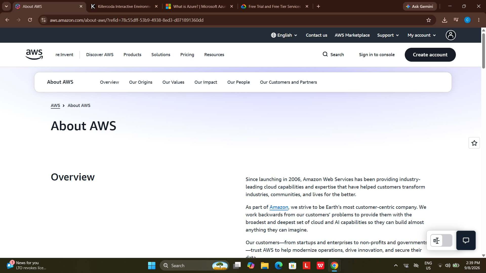

# AWS Research Report: Amazon Web Services

## Brief Overview
Since launching in 2006, Amazon Web Services (AWS) has provided industry-leading cloud capabilities to help startups, enterprises, non-profits, and governments modernize operations and secure their data. As part of Amazon, AWS works backward from customer problems to deliver cloud and AI capabilities.

## Global Infrastructure
AWS operates on a global scale designed for high availability and low latency:
* **Regions:** Geographic areas around the world containing multiple isolated data centers.
* **Availability Zones (AZs):** Discrete data centers within a region with redundant power, networking, and connectivity.
* **Edge Locations:** A global network of Points of Presence (PoPs) used to cache and deliver content quickly to end-users.

## Cloud Management Console
The **AWS Management Console** is a web-based interface providing access to manage AWS resources:
* Features customizable home page dashboards with draggable widgets.
* Includes integrated access to **AWS CloudShell** directly from the browser window.
* Provides a unified search bar to locate services, resource groups, and documentation instantly.

## Four (4) Core Services
* **Amazon EC2 (Elastic Compute Cloud):** Resizable virtual servers that host dynamic software applications.
* **Amazon S3 (Simple Storage Service):** Scalable object storage built for backup, archiving, and data analysis.
* **Amazon VPC (Virtual Private Cloud):** Isolated virtual network environments where AWS resources are launched securely.
* **AWS IAM (Identity and Access Management):** Access management service controlling authentication and authorization for AWS users and roles.

## Three (3) Key Advantages
* **Market Pioneer & Ecosystem Maturity:** Broadest range of mature cloud services and third-party integrations.
* **Global Scale & Reliability:** Unmatched infrastructure footprint ensuring fault tolerance and high availability.
* **Flexible Cost Models:** Offers pay-as-you-go pricing, Reserved Instances, and Savings Plans for cost optimization.

## Typical Enterprise Use Cases
* Web and mobile application backends requiring dynamic scaling.
* Enterprise data warehousing and big data processing.
* Global media content delivery networks (CDN).

## References & Sources
* [AWS Official Overview](https://aws.amazon.com/about-aws/)
